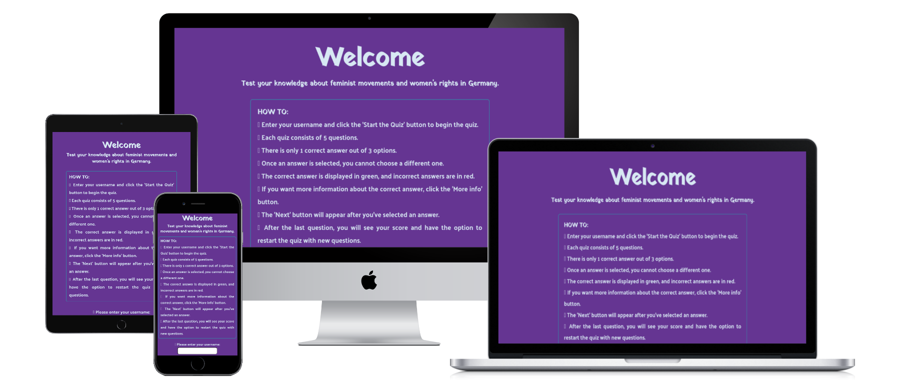
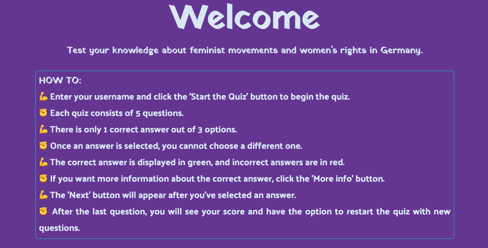
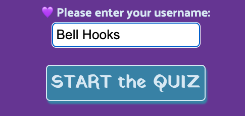
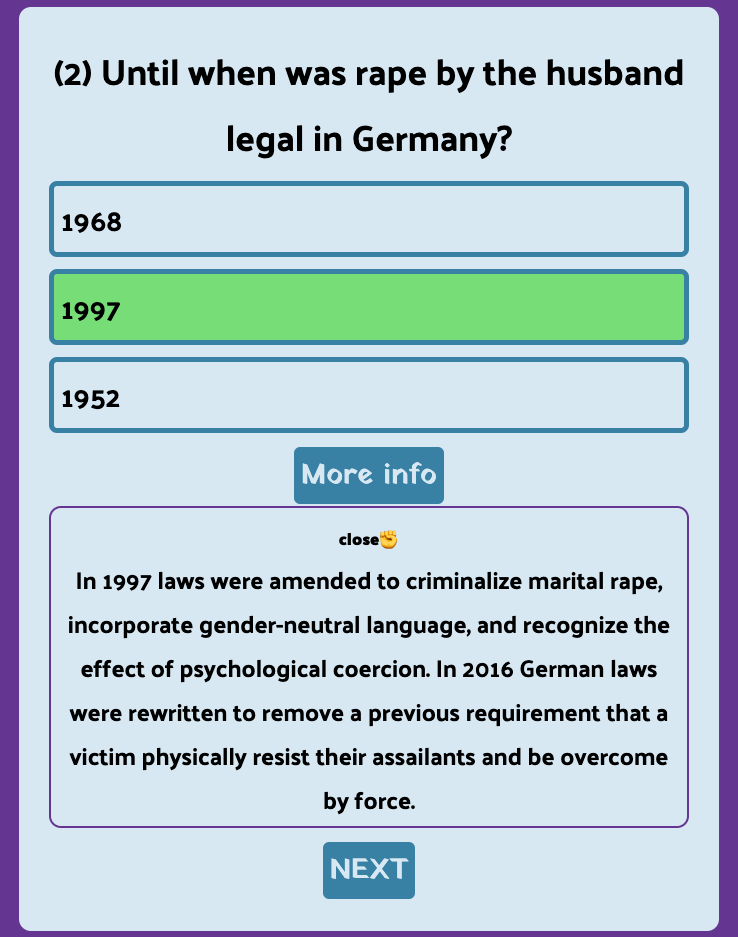

# :purple_circle: *Feminism Quiz* :purple_circle:

Feminism Quiz is an educational and informative site with questions about the history and milestones of feminist movements in Germany. Users can assess their knowledge and fill gaps in their understanding while enjoying a game.

 

💜 The deployed page can be found [here](https://zabokaa.github.io/FeminismQuiz/) ✊

## Table of Contents

- [Objective](#objective)
- [User Stories](#user-stories)
- [Key Features](#key-features)
- [Design](#design)
- [Testing](#testing)
  - [Manual](#manual)
  - [Official Validators](#official-validators)
  - [Bugs](#bugs)
- [Technologies](#technologies)
- [Deployment](#deployment)
- [Project Status](#project-status)
- [Acknowledgements](#acknowledgements)

## Objective

- Hands-on learning JavaScript basics by building an interactive front-end application
- To offer a stimulating quiz experience that entertains online users
- Users visiting the site aim to engage in an online quiz to evaluate their general or specific knowledge about women's history in Germany

## User Stories

- As a user, I want interactive learning.
- As a user, I want to see the correct and incorrect answers for each question.
- As a user, I like to have theh possibility to get more background information about the correct answer.
- As a user, I expect a consistent and responsive design for easy use on various devices, prioritizing mobile devices first.
- As a user, I want new questions randomly picked for a new quiz round.
- As a user, I want to see my score at the end of a round.
- As a user, I want to easily navigate the site.

## Key Features

### Start Page

  

### User Login and Start Quiz

  

### Quiz Section

  

### Modal for backgroudn info about correct answer

  

### End of Game Round --> Score and Play again

  

### Footer

  

## Design

### Colors

As primary and secondary colors, I chose purple and green (here with a more bluish tone) because they are two colors globally connected to feminist movements.

  

For indicating the correct and incorrect answer of each questions I use green and red because the colors are self-explanatory in this context. I chose a pastel colour in each case because it is easier to integrate into the colour palette of the page.

## Testing

### Manual

- Navigation is working.
- After entering a username, the user can press the "Start the Quiz" button.
- The intro section will not be displayed while showing the quiz section.
- If a username has been entered, it is stored for the next round.
- "Next" and "Modal" buttons are only displayed after the user has selected an answer.
- The user can only select one answer.
- The "Modal" button ("More Info") can be closed manually, and if the user did not, it will close when displaying the next question.
- Questions are picked randomly for each new round.

### Official Validators

- [W3C HTML Validator](./assets/img/htmlVal.png): No errors
- [W3C CSS Validator](./assets/img/CSSvalidator.png):  No errors
- [Lighthouse Chrome DevTools](./assets/img/lighthouseVal.png): Accessibility 100
- [WAVE](./assets/img/WAVEval.png): No errors for accessibility and color contrast

### Bugs

- When a user wants to restart the game the shuffle funcion was not called. I fixed the bug by moving `randomize(questions);` to the `openQuiz()` function.

- When user did not close the modal box it has been displayed (beiing open) on the next slide. I fixed it using following if-statment `if (modal.style.display === "block") {
        modal.style.display = "none";
    }`

## Technologies

JavaScript | HTML | CSS

## Project Status

Project is: finished

## Deployment

- The site is deployed on Github Pages.

  HOW TO:

  1. **Go to Repository Settings:**
     In your GitHub repository, navigate to the "Settings" tab.
  
  2. **Scroll Down to GitHub Pages Section:**
     In the Settings, scroll down to the "GitHub Pages" section.
  
  3. **Choose Your Source Branch:**
     Under "Source," select the branch you want to use for GitHub Pages (e.g., `main`).
  
  4. **Save Your Changes:**
     Save the changes. GitHub Pages will provide you with a link to your deployed site.
  
  5. **Wait for the Build:**
     GitHub Pages will now build and deploy your site. Wait for the process to complete.
  
  6. **Access Your Deployed Site:**
     Once the build is successful, you can access your deployed site using the provided link.

  Your project is now live on GitHub Pages!

## Acknowledgements

This project was based on full-stack course @ Code Institute.

Ideas for code snippets (commented in my code)

- [W3School](https://www.w3schools.com/howto/howto_css_modals.asp) [for modal code]
- [Web Dev Simplified](https://www.youtube.com/watch?v=riDzcEQbX6k) [as quoted in script.js]

The content of some questions are taken from:

- [GeoWissen](https://www.geo.de/wissen/quiz/quiz-was-wissen-sie-uber-die-frauenbewegung-30203104.html) [translated by me]
- [Amnesty International](https://www.amnesty.de/sites/default/files/2019-03/Quiz-Frauenrechte-2019.pdf) [translated by me]
